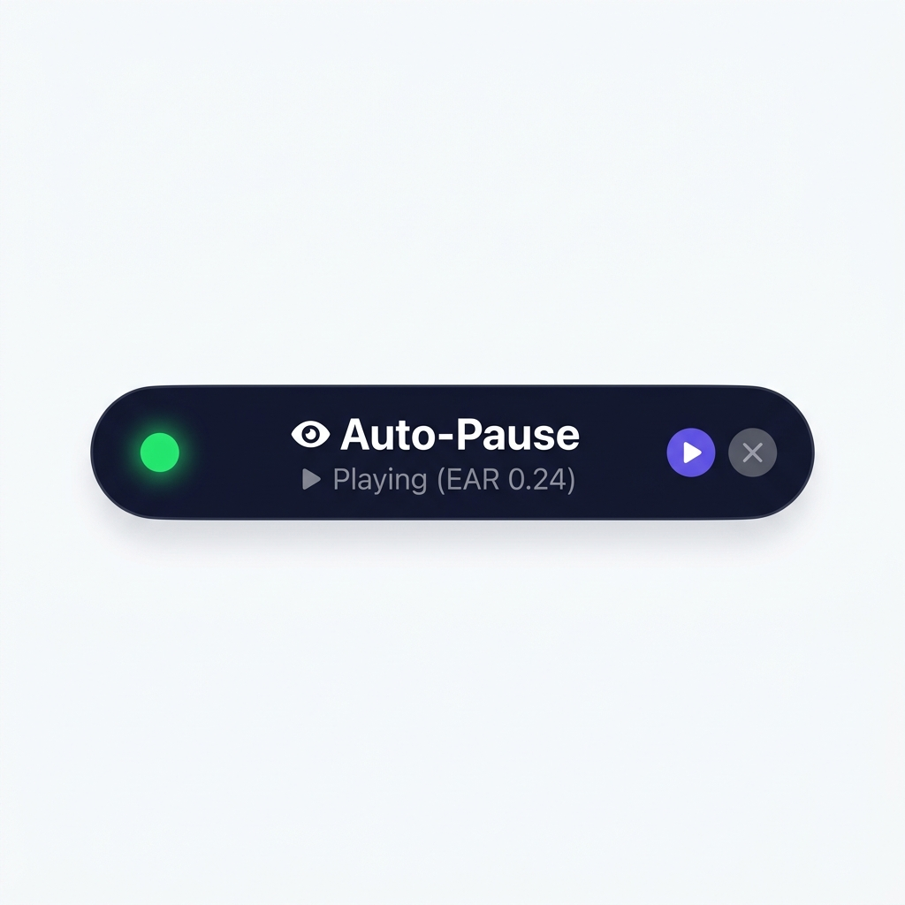
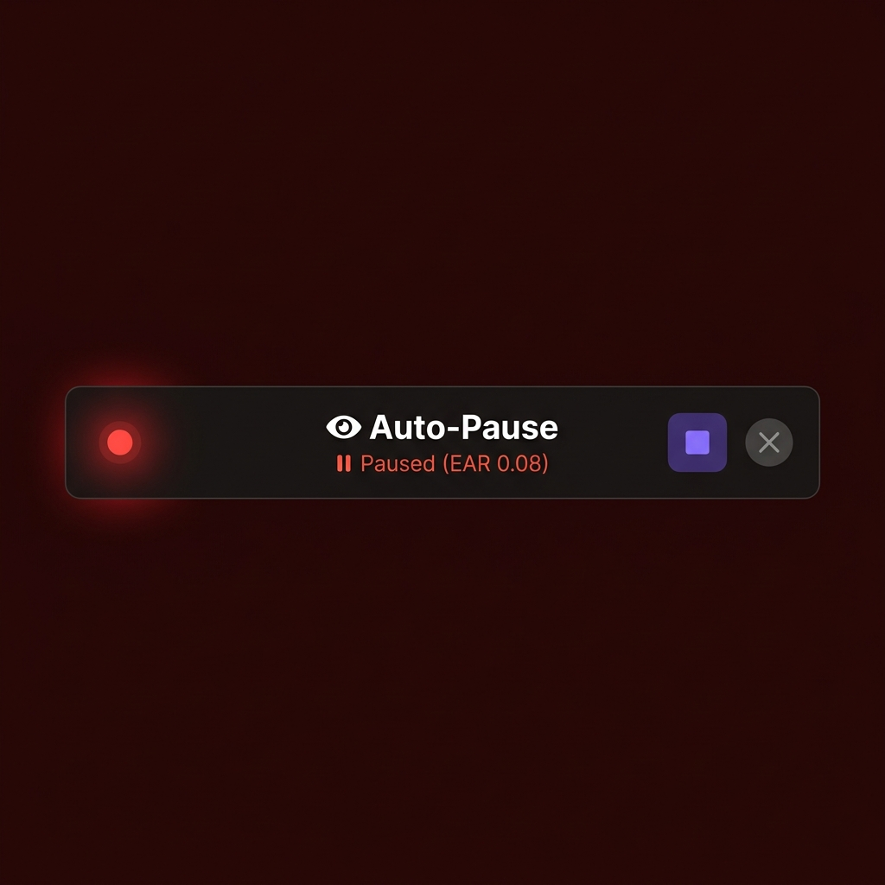
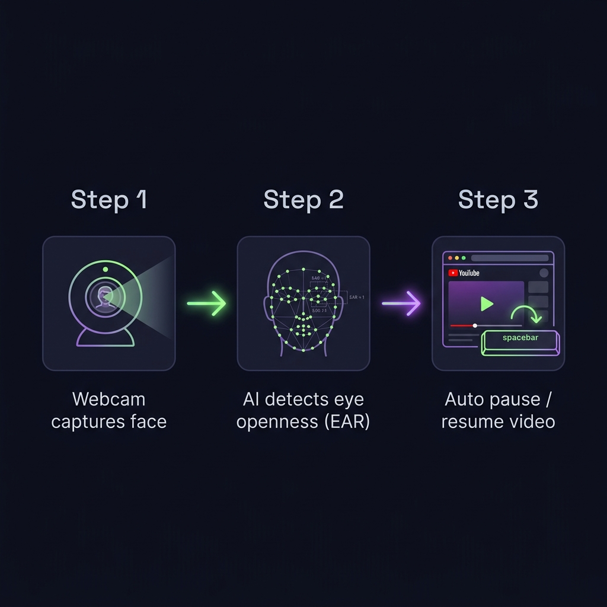

<div align="center">

<!-- Animated header -->


<br/>

[](https://python.org)
[](https://mediapipe.dev)
[](https://opencv.org)
[](LICENSE)
[](https://www.microsoft.com/windows)

<br/>

> **Never lose your place in a video again.**
> Auto-Pause watches your eyes — when you look away, it pauses. When you look back, it resumes. Zero clicks. Pure magic.

<br/>

</div>

---

## ✨ Features

<div align="center">

| Feature | Details |
|:---:|:---|
| 👁️ **Real-time Eye Tracking** | Uses Google MediaPipe's 478-point face mesh to track eye openness (EAR) |
| ⏸️ **Smart Auto-Pause** | Pauses after you look away for a configurable delay (default 1.5s) |
| ▶️ **Auto-Resume** | Resumes when you look back (default 0.5s confirmation delay) |
| 🪟 **Floating Translucent Bar** | Minimal always-on-top HUD — no clutter, no distraction |
| 🖱️ **Drag to Reposition** | Grab the bar and drag it anywhere on screen |
| ❌ **Close = Exit** | Hit ✕ on the bar and the entire app shuts down |
| ⚡ **Ultra-Lightweight** | Low-res capture, frame skipping, single thread — minimal CPU/RAM |
| 📦 **Single EXE** | Double-click `AutoPause.exe` — no Python install needed |

</div>

---

## 🖼️ Screenshots

<div align="center">

### 🟢 Watching — Playing State


<br/><br/>

### 🔴 Looked Away — Paused State


</div>

---

## 🧠 How It Works

<div align="center">



</div>

<br/>

The app uses the **Eye Aspect Ratio (EAR)** — a well-known computer vision metric:

$$\text{EAR} = \frac{||p_1 - p_5|| + ||p_2 - p_4||}{2 \cdot ||p_3 - p_6||}$$

- **EAR > 0.18** → Eyes open → You're watching → Video plays ▶️
- **EAR < 0.18** → Eyes closed / face gone → Looked away → Video pauses ⏸️

The face mesh is powered by **Google MediaPipe Face Landmarker** running locally — **no internet required at runtime**, completely private.

---

## 🚀 Quick Start

### Option A — Double-click EXE *(Recommended)*

```
dist/AutoPause.exe
```
Just double-click. The floating bar appears at the top of your screen. Done. ✅

### Option B — Run from Source

**1. Clone the repo**
```bash
git clone https://github.com/theatharvagai/eye-tracker.git
cd eye-tracker
```

**2. Install dependencies**
```bash
pip install -r requirements.txt
```

**3. Run**
```bash
python main.py
```

> 💡 **Tip:** Click the YouTube video tab first so spacebar reaches it, then press ▶ on the bar.

---

## 📦 Build Your Own EXE

```bash
# On Windows, just run:
build_exe.bat
```

This will:
- Install all dependencies + PyInstaller
- Bundle everything (including the face model) into a single `dist/AutoPause.exe`
- ~80–90 MB, no Python needed on target machine

---

## ⚙️ Configuration

Open `main.py` and tweak these constants at the top:

```python
LOOK_AWAY_DELAY    = 1.5    # seconds away before pausing
LOOK_BACK_DELAY    = 0.5    # seconds back before resuming
CAMERA_INDEX       = 0      # webcam index (try 1 if 0 doesn't work)
EYE_OPEN_THRESHOLD = 0.18   # EAR below this = eyes considered closed
BLINK_FRAMES       = 3      # blink grace — short blinks are ignored
CAM_WIDTH          = 320    # camera resolution (lower = faster)
CAM_HEIGHT         = 240
PROCESS_EVERY_N    = 3      # run AI detection every N frames
```

---

## 🛠️ Tech Stack

<div align="center">

| Component | Technology |
|:---:|:---|
| 🧠 **Face/Eye AI** | [MediaPipe Face Landmarker](https://ai.google.dev/edge/mediapipe/solutions/vision/face_landmarker) |
| 📷 **Camera** | OpenCV with DirectShow backend (`cv2.CAP_DSHOW`) |
| ⌨️ **Keyboard** | PyAutoGUI spacebar press |
| 🪟 **UI** | Tkinter — minimal, no-title-bar floating bar |
| 📐 **Math** | NumPy for EAR calculation |
| 📦 **EXE Packaging** | PyInstaller (`--onefile --windowed`) |

</div>

---

## 📁 Project Structure

```
eye-tracker/
│
├── 📄 main.py               ← Core app (eye tracker + floating bar UI)
├── 📄 requirements.txt      ← Python dependencies
├── 📄 build_exe.bat         ← One-click EXE builder
├── 🧠 face_landmarker.task  ← MediaPipe model (~3.7 MB)
│
├── 📁 assets/               ← README images
│   ├── floating_bar_preview.png
│   ├── paused_state_bar.png
│   └── how_it_works_diagram.png
│
└── 📁 dist/                 ← Built EXE lives here (after build_exe.bat)
    └── AutoPause.exe
```

---

## 🔧 Troubleshooting

| Problem | Fix |
|:---|:---|
| Camera not opening | Try `CAMERA_INDEX = 1` in `main.py` |
| Spacebar not reaching YouTube | Click the YouTube tab before pressing ▶ |
| Pausing too aggressively | Increase `LOOK_AWAY_DELAY` (e.g. `2.5`) |
| Not pausing when you look away | Lower `EYE_OPEN_THRESHOLD` (e.g. `0.15`) |
| High CPU usage | Increase `PROCESS_EVERY_N` (e.g. `5`) |
| Model download fails | Download manually from [MediaPipe releases](https://storage.googleapis.com/mediapipe-models/face_landmarker/face_landmarker/float16/1/face_landmarker.task) and place in project root |

---

## 📋 Requirements

- Windows 10/11
- Python 3.10+ (only for source run)
- Webcam
- `opencv-python`, `mediapipe`, `pyautogui`, `numpy`

---

## 📜 License

This project is licensed under the **MIT License** — see [LICENSE](LICENSE) for details.

---

<div align="center">


**Made with 👁️ by [Atharv Agai](https://github.com/theatharvagai)**

*Star ⭐ the repo if this saved you from missing a scene!*

</div>
